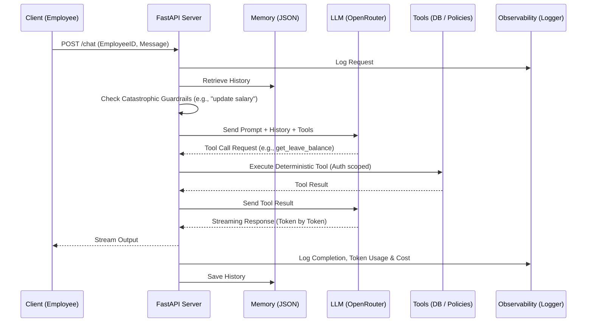

# HR Helpdesk Assistant V1

This repository contains a working LLM-powered HR Helpdesk Assistant that demonstrates:
- Tool calling (Retrieval of employee records & policies)
- Streaming responses
- Conversation memory
- Security guardrails & authorization scoping
- Structured JSON logging & token cost calculation
- Strict structured output for ticket classification

## Architecture



## Prerequisites
- Python 3.14+ (or compatible version)
- An OpenRouter API Key (or OpenAI API Key)

## Setup

1. **Install dependencies**
   ```bash
   pip install -e .
   ```
   *or if using `uv`:*
   ```bash
   uv pip install -e .
   ```

2. **Configure Environment**
   Update the `.env` file with your API key:
   ```env
   OPENROUTER_API_KEY=your_api_key_here
   ```

3. **Run the Server**
   Start the FastAPI server:
   ```bash
   fastapi run app/main.py --port 8000
   ```

4. **Run the Demo**
   In a separate terminal, run the CLI script to execute the demo scenarios:
   ```bash
   python app/cli.py demo
   ```

## Included Deliverables
- `diagnosis_writeup.md`: Root cause analysis of an early failure.
- `security_notes.md`: Security guardrail and prompt injection testing details.
- `app.log`: Structured JSON logs including token costs generated when interacting with the app.
- `app/cli.py`: A script that demonstrates all required behaviors side-by-side.
